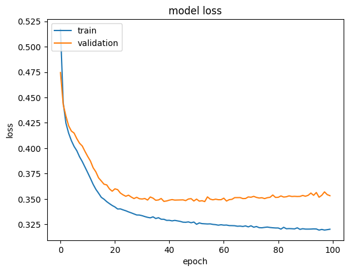
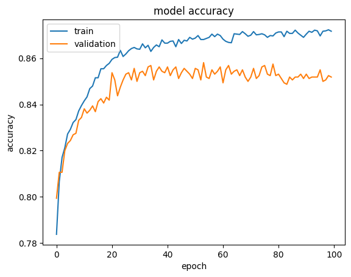

# Credit Card Customer Churn Prediction (ANN)

This project builds an **Artificial Neural Network (ANN)** using TensorFlow/Keras to predict whether a customer will churn (exit) based on their credit card usage and demographics.

---

##  Project Overview
- **Dataset**: `Churn_Modelling.csv`
- **Input Features**: Customer demographics, geography, balance, credit score, activity, etc.
- **Target**: `Exited` (1 = churn, 0 = stay)

---

##  Model Architecture
- Input Layer: 10 features
- Hidden Layer 1: Dense (10 neurons, ReLU)
- Hidden Layer 2: Dense (10 neurons, ReLU)
- Hidden Layer 3: Dense (10 neurons, ReLU)
- Output Layer: Dense (1 neuron, Sigmoid)

---

##  Training
- Optimizer: Adam (default in Keras)
- Loss Function: Binary Cross-Entropy
- Epochs: 100
- Validation Split: 20%

---

##  Results
- Predictions generated using `model.predict()` followed by thresholding at 0.5.
- Evaluation with **accuracy_score** from scikit-learn.
- Training and validation curves plotted.

---
